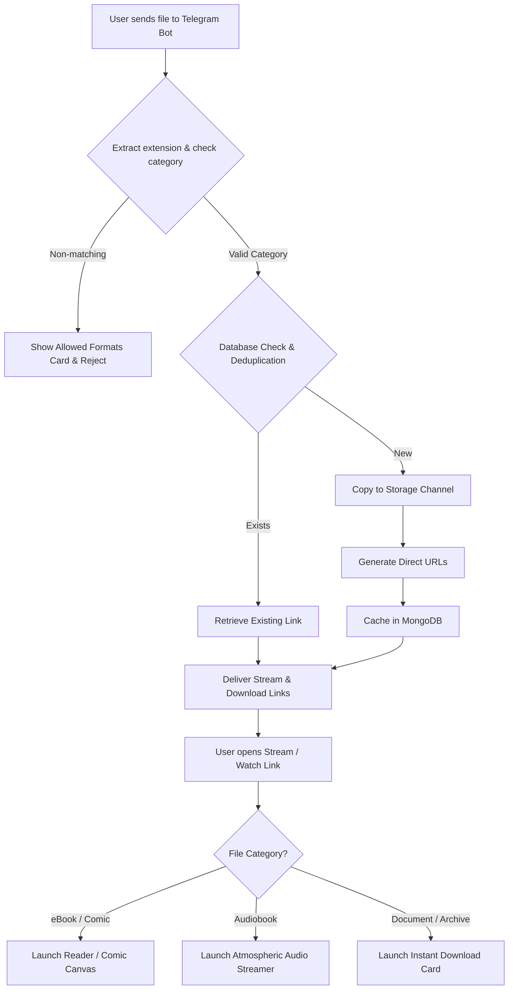

# Project Plan — Smart Book to Link Bot

This document outlines the detailed architecture, design decisions, and implementation plan for the **Smart Book to Link** project. The project is rebuilt inside the `Smart-Book-to-Link-project` directory.

---

## 📋 Project Specifications & Allowed Formats

The bot acts as a high-performance Telegram File-to-Link streamer, but specializes strictly in **eBooks, Documents, Audiobooks, and Archives**. All other file types (like videos, executables, system files, pictures, or generic media) are actively rejected.

| Category | Allowed File Extensions | Playback/Viewer Action |
| :--- | :--- | :--- |
| **eBooks** | `.pdf`, `.epub`, `.mobi`, `.azw`, `.azw3`, `.djvu`, `.fb2`, `.lit`, `.cbr`, `.cbz` | Opens in **Custom Ebook / Comic Viewer** (`ebook.html`) |
| **Documents** | `.doc`, `.docx`, `.txt`, `.rtf`, `.odt` | Previews details or downloads via direct link |
| **Audiobooks** | `.mp3`, `.m4b`, `.m4a`, `.ogg`, `.flac`, `.aac`, `.wav`, `.opus` | Plays in the **Atmospheric Audio Player** |
| **Archives** | `.zip`, `.rar`, `.7z`, `.tar`, `.gz` | Direct download page only (`dl.html`) |

---

## 🛠️ Architecture & Design Changes

### 1. Unified Format Validator (`Thunder/utils/file_properties.py`)
* We will define clear mappings for the four categories: `EBOOKS`, `DOCUMENTS`, `AUDIOBOOKS`, and `ARCHIVES`.
* Implement a helper function `get_file_category(file_name: str) -> Optional[str]` to check if a file extension falls into one of the allowed categories and return its category.
* Any file sending/processing handlers will invoke this function. If it returns `None`, the file is blocked.

### 2. Strict Input Filtering (`Thunder/bot/plugins/stream.py`)
* Update standard receive handlers (`private_receive_handler`, `channel_receive_handler`, `link_handler`) to enforce validation.
* If a user sends a file that is not allowed, the bot will immediately reply with an elegant, localized message detailing the allowed categories and formats, and abort the link generation.

### 3. Dynamic Template Routing (`Thunder/utils/render_template.py`)
* Modify rendering logic to serve the correct preview templates based on the validated category:
  * **eBooks** (`.pdf`, `.epub`, `.mobi`, `.azw`, `.azw3`, `.djvu`, `.fb2`, `.lit`, `.cbr`, `.cbz`) ➔ `ebook.html` (interactive reader).
  * **Audiobooks** (`.mp3`, `.m4b`, `.m4a`, `.ogg`, `.flac`, `.aac`, `.wav`, `.opus`) ➔ Custom audio streaming layout inside a responsive player page.
  * **Documents & Archives** ➔ Clean download template (`dl.html`).

### 4. Custom Reader Upgrades (`Thunder/template/ebook.html`)
* Keep the existing EPUB.js and PDF.js (v4.4) integrations.
* Add comic book archive viewer support:
  * Integrate client-side extraction (using standard JS ZIP libraries like `JSZip` for `.cbz` archives) to unpack images and display them sequentially in a beautiful scrolling canvas/comic viewer interface.
  * Add formatting/viewer support for non-paginated document extensions like `.txt` directly inside the reader.
  * For legacy ebook types that cannot be rendered entirely client-side without heavy servers (`.mobi`, `.azw3`, `.djvu`), show a high-end styled download card page with a direct "Download and Read Offline" call-to-action.

---

## 📈 Request Lifecycle Flowchart

---

## 🚀 Execution & Implementation Plan

### Step 1: Format Validation Layer
Modify `Thunder/utils/file_properties.py` to support classification of extensions and categories.

### Step 2: Enforce Bot Validation
Update `Thunder/bot/plugins/stream.py` to parse the files, reject non-supported extensions, and present clean feedback to users.

### Step 3: Page Routing Adjustments
Update `Thunder/utils/render_template.py` and `Thunder/server/stream_routes.py` to properly pass the mime/category structures and render templates.

### Step 4: Template Customization
Refine `ebook.html` and player rendering templates to adapt dynamically to the designated document/audiobook types.
